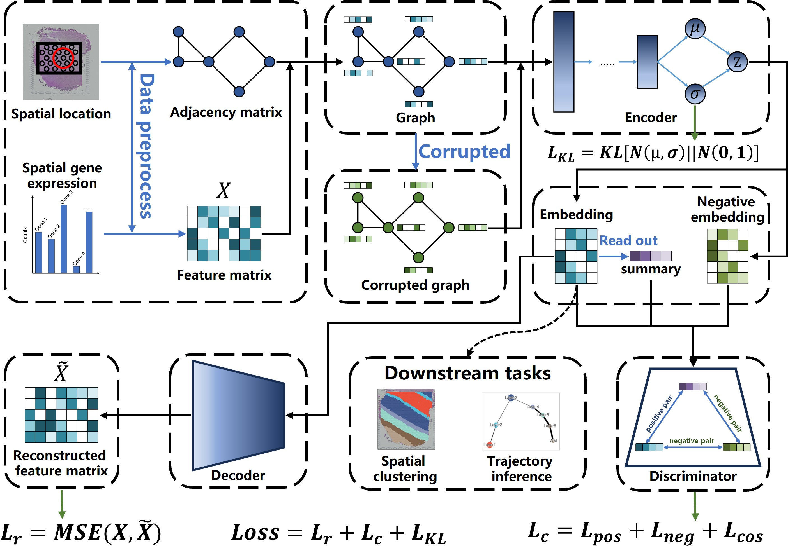

# Unraveling Spatial Domain Characterization in Spatially Resolved Transcriptomics with Robust Graph Contrastive Clustering

## Introduction

we developed a deep graph contrastive clustering framework, named stDGCC, aiming to elucidate accurately the underlying spatial domains by explicitly integrating spatial information and gene expression profiles. stDGCC uses a spatially informed graph node embedding model to extract informative cellular information of the spatial information and gene expression profiles from ST data in an unsupervised manner. Then, by constructing positive and negative graphs, the encoder incorporates both graphs to obtain positive and negative embeddings for contrastive learning, allowing learning of shared semantic representations across different modalities. In addition, three training losses, namely the contrastive learning loss, reconstruction loss, and Kullback–Leibler (KL) divergence loss, are optimized simultaneously to achieve informative and discriminative feature learning while preserving the topological representation of the cell spot-spot relationships.


## Installation

You can install the dependencies using the following command

```
conda env create -f environment.yml
```

## Data

You can download these raw datasets from the source of the raw datasets.

|                  Dataset                  |                             Link                             |
| :---------------------------------------: | :----------------------------------------------------------: |
|                   DLPFC                   |            http://research.libd.org/spatialLIBD/             |
|       Mouse Brain Section (Coronal)       | https://support.10xgenomics.com/spatial-gene-expression/datasets |
|              Puck_190921_21               | https://singlecell.broadinstitute.org/single_cell/study/SCP815/highly-sensitive-spatial-transcriptomics-at-near-cellular-resolution-with-slide-seqv2#study-summary |
|             Puck\_180531\_23              | https://portals.broadinstitute.org/single_cell/study/slide-seq-study |
| pnas.1912459116.sd12 pnas.1912459116.sd15 |     https://www.pnas.org/doi/abs/10.1073/pnas.1912459116     |

We have also organized and made available the raw data and model files from the paper, which you can download at figshare: https://figshare.com/projects/stDGCC/186525.

## Usage

### data_generation.py: This code file is used to preprocess the data, if you want to run this file you need to download the original dataset in advance.

DLPFC/151507

```
python data_generation.py --data_path dataset/DLPFC/ --data_name 151507 --generated_data_path generated_data/DLPFC/ --platform 10x --threshold 250
```

MB

```
python data_generation.py --data_path dataset/ --data_name MB --generated_data_path generated_data/ --platform 10x --threshold 100
```

MH (mouse hippocampus  profiled by Slide-seqV2)

```
python data_generation.py --data_path dataset/ --data_name MH --generated_data_path generated_data/ --platform Slide-seqV2 --threshold 100 --min_cells 50
```

MH1 (mouse hippocampus  profiled by Slide-seq)

```
python data_generation.py --data_path dataset/ --data_name MH1 --generated_data_path generated_data/ --platform Slide-seqV1 --threshold 50 --min_cells 25
```

HO

```
python data_generation.py --data_path dataset/ --data_name HO --generated_data_path generated_data/ --platform MERFISH --threshold 200 --HVG 3000 --min_cells 500
```

### run.py: This code file is used to train the model, and we have provided data and results from this code. If you need to import our trained model directly, you can use the --load 1

DLPFC/151507

```
python run.py --data_path generated_data/DLPFC/ --data_name 151507 --num_epoch 2500 --DGI_P 2.0 --MSE_P 0.05 --KL_P 0.005 --HVG 3000 --threshold 250 --lambda_I 0.8 --n_clusters 7 --learning_rate 1e-5  --platform 10x --model_path model/DLPFC/ --embedding_data_path embedding/DLPFC/ --result_path result/DLPFC/
```

MB

```
python run.py --data_path generated_data/ --data_name MB --num_epoch 5000 --DGI_P 2.0 --MSE_P 0.1 --KL_P 0.005 --HVG 3000 --threshold 50 --lambda_I 0.8 --n_clusters 12 --learning_rate 1e-5  --platform 10x --model_path model/ --embedding_data_path embedding/ --result_path result/
```

MH

```
python run.py --data_path generated_data/ --data_name MH --num_epoch 900 --DGI_P 1.0 --MSE_P 0.02 --KL_P 0.005 --HVG 3000 --threshold 100 --lambda_I 0.8 --n_clusters 12 --learning_rate 3e-5  --platform Slide-seqV2 --model_path model/ --embedding_data_path embedding/ --result_path result/
```

MH1

```
python run.py --data_path generated_data/ --data_name MH1 --num_epoch 900 --DGI_P 1.0 --MSE_P 0.1 --KL_P 0.025 --HVG 3000 --threshold 50 --lambda_I 0.8 --n_clusters 7 --learning_rate 3e-5  --platform Slide-seqV1 --model_path model/ --embedding_data_path embedding/ --result_path result/
```

HO

```
python run.py --data_path generated_data/ --data_name HO --num_epoch 7000 --DGI_P 2.0 --MSE_P 0.2 --KL_P 0.005 --HVG 3000 --threshold 200 --lambda_I 0.8 --n_clusters 5 --learning_rate 1e-5  --platform MERFISH --model_path model/ --embedding_data_path embedding/ --result_path result/
```

### ARI&NMI.ipynb: This code file is used for results display.
